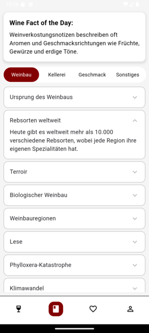

# VinoVeritas

Wir verwenden das Unterstrich-Namenskonvention ("_") mit ausschließlich Kleinbuchstaben.

Deutsche Version der Dokumentation, Englisch folgt, wenn die Deutsche passt:

## Abstract

VinoVeritas ist eine App, die eine stressfreie und gelungene Auswahl von Weinen ermöglicht. Sie bietet verschiedene Filtermöglichkeiten, eine eigene Favoritenliste, die Möglichkeit, Favoriten zu teilen, sowie ein Mini-Lexikon, um mit dem Fachjargon besser zurechtzukommen und das Wissen zu erweitern.
Beschreibung

Fast jeder kennt es: Man steht vor einem überfüllten Regal und weiß nicht, was man nehmen soll. Ob für eine Geburtstagsfeier, einen romantischen Abend zu zweit, für die Kollegen oder einfach für ein entspanntes Abendessen mit der Familie – der richtige Wein macht den Anlass noch besser. Doch die Frage ist: Welcher Wein soll es sein?

In den meisten Supermärkten gibt es eine unglaubliche Auswahl an Weinen, und meist gibt es nicht nur einen Supermarkt in der Stadt. Diese schier unendliche Auswahl an Weinen aus verschiedensten Herkunftsländern ist der Entstehungsgrund für diese App. Die App soll dafür sorgen, dass Menschen, die nicht die Zeit haben, sich intensiver mit dem Thema Wein auseinanderzusetzen, auch einen Wein finden können, der genau ihren Ansprüchen entspricht.

Diese App richtet sich vornehmlich an Menschen, die leicht passenden Wein zu guten Preisen erwerben möchten. Sie bietet Informationen über Weine vom niedrigen bis mittleren Preissegment sowie die Standorte, wo dieser Wein in einem Supermarkt erhältlich ist. Durch verschiedene Filter- und Sortieroptionen (Essen, Geschmack, Farbe und Preis) können Nutzerinnen und Nutzer ganz nach ihrem Geschmack und Anlass den perfekten Wein finden.

Damit man nicht jedes Mal neu suchen muss, können Lieblingsweine in der persönlichen Favoritenliste abgespeichert werden. So hat man die Lieblingsweine immer schnell zur Hand. Auch die Lieblingsweine von Freunden können leicht angeschaut werden, indem Favoritenlisten miteinander geteilt werden.

Süß, trocken, Blanc de Noir, kräftig, mit Tanninen, holzig, Pinot Gris, Eichenfass, Grauburgunder, Kork, etc. Das alles sind Begriffe, die auf Weinflaschen und in der App zu finden sind. Doch was steckt hinter diesen Begriffen? Das und vieles mehr wird im kleinen Wein-Lexikon erklärt. Hier können Begriffe nachgelesen werden, die in der App, auf Flaschen oder bei anderen Gelegenheiten aufgeschnappt wurden. So wird ohne viel Zeitaufwand mehr Hintergrundwissen geschaffen, um ein besseres Verständnis zu ermöglichen, was zu einer besseren Weinauswahl führen kann.

## Screens & Funktionen

Im Folgenden wird kurz erläutert, welche Screens die App beinhaltet und welche Funktionen es dort gibt.

### Anmelden

Beim ersten Öffnen der App wird der Anmelde-Screen angezeigt. Hier wird der Benutzername eingegeben, und dann kann es auch schon losgehen.

### Homepage

Das Herzstück dieser App ist die Homepage. Hier wird sofort eine bunte Mischung verschiedenster Weine mit übersichtlichen Informationen angezeigt. Um den richtigen Wein zu finden, können die verschiedenen Filterfunktionen verwendet werden. Unter Essen & Geschmack kann ausgewählt werden, zu welchem Essen der Wein passen soll oder welche Geschmacksnote enthalten sein soll. Auch können die angezeigten Weine nach Farbe oder Preis sortiert werden.  
Interessiert einen ein Wein, kann man mit einem Tab auf ihn weitere Informationen erhalten (siehe auch Detailansicht Wein).  
Über den Filtern befindet sich eine Suchleiste, wenn nach einem bestimmten Wein gesucht werden soll. 
Mit einem Tab auf das Herz an jedem Wein lässt sich der ausgewählte Wein der eigenen Favoritenliste ganz einfach hinzufügen und durch einen weiteren Tab auf das Herz wieder entfernen.  
Unten auf dem Screen befindet sich die Navigationsleiste der App. Die aktuelle Seite wird durch eine rote Hintergrundfarbe gekennzeichnet. Die erste Seite mit dem Weinglas-Icon ist die Homepage, eins weiter rechts gelangt man zum Lexikon (Buch-Icon). Bei einem Tab auf das Herz gelangt man zu seiner Favoritenliste und zuletzt gibt es noch die Einstellungsseite mit dem Personen-Icon.

### Detailansicht Wein

In der Detailansicht eines Weines wird dieser noch einmal ausführlicher vorgestellt. Es werden Informationen über Preis, Größe, Trockenheit, Süße und Tanningehalt angezeigt.  
Unter dem Bild befindet sich eine ausklappbare Informationspalette. Hier werden die Geschmackskomponenten des Weines, passende Gerichte und eine textuelle Beschreibung angezeigt.  
Unter den Beschreibungen des Weines befinden sich Supermärkte, in denen dieser Wein erhältlich ist. Die Adresse sowie der Preis in diesem Laden werden angezeigt. Mit einem Klick auf den Pfeil verlässt man die App und gelangt auf Google Maps mit dem gekennzeichneten Supermarkt. So spart sich der Nutzer eine umständliche Suche nach dem entsprechenden Supermarkt.

### Lexikon

|  | Direkt darunter befindet sich der Wein-Fakt des Tages. Hier gibt es täglich einen neuen spannenden Fakt über Wein. Das ermöglicht Wissensvermittlung, ohne dass der Nutzer sich durch das Lexikon klicken muss.   Unter dem Fakt des Tages befinden sich verschiedene Kategorien von Weinbau bis hin zum fertigen Wein im Glas. So kann gezielter nach Informationen innerhalb der verschiedenen Stadien gesucht werden, um zu lernen, welche verschiedenen Aspekte ein Wein mit sich bringt. Durch die Dropdowns können schnell Themen gefunden werden, die einen interessieren, und durch das Ausklappen werden die Informationen angezeigt. |

### Favoritenliste

Die Favoriten Seite ist sehr ähnlich der Homepage. Hinzu kommt jedoch die Auswahlmöglichkeit (mittels Dropdown-Auswahl), welche Favoritenliste angezeigt werden soll, da auch mit Freunden die Listen geteilt und angesehen werden können.  
Hier werden nur die Weine angezeigt, die mit dem Herz markiert wurden. Bei einem Tab auf den Wein gelangt man hier ebenfalls auf die Detailansicht des Weines.

### Einstellungen

Unter "Benutzername" kann ein neuer Benutzername zugewiesen werden.  
Unter "Design" kann zwischen dem hellen und dem dunklen Modus gewählt werden.  
Unter "Teilen mit deinen Favoriten" findet der Nutzer seinen persönlichen Code, den er an seine Freunde senden kann, damit diese auf die eigene Liste zugreifen können. Unten drunter gibt es die Möglichkeit, zugesendete Codes einzugeben (unter Weincode), und unter "Name der Liste" kann der importierten Liste ein Name gegeben werden, um die Übersicht zu behalten. Mit einem Tab auf "Importieren" wird dann die Liste importiert.

## Architektur 

### Hier steht die grobe beschreibung 
### Hier kommt das Schaubild hin
