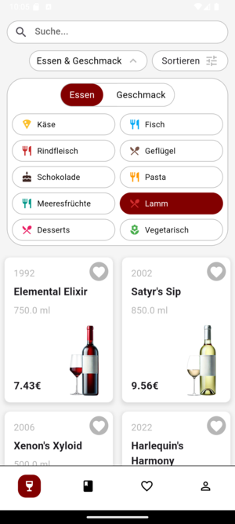
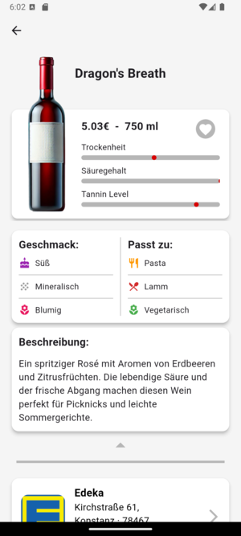
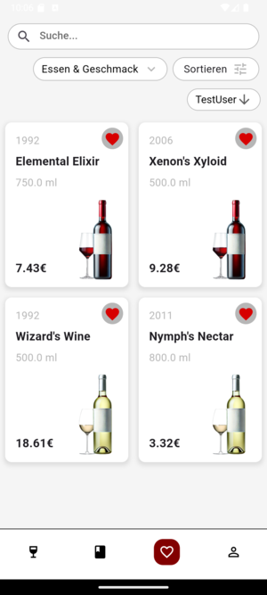
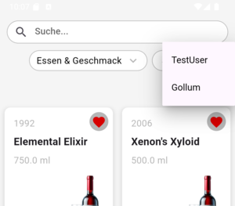
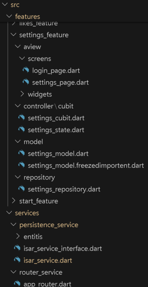

# VinoVeritas

We use the underscore naming convention ("_") with lowercase letters only.

German version of the documentation, English will follow when the German version fits:

## Abstract

VinoVeritas is an app that enables a stress-free and successful selection of wines. It offers various filtering options, its own favorites list, the ability to share favorites, and a mini-encyclopedia to help you get to grips with the technical jargon and expand your knowledge.

## Description

Almost everyone knows it: you're standing in front of a crowded shelf and don't know what to take. Whether for a birthday party, a romantic evening for two, for colleagues or simply for a relaxed dinner with the family - the right wine makes the occasion even better. But the question is: which wine should it be?

Most supermarkets have an incredible selection of wines, and there is usually not just one supermarket in town. This seemingly endless selection of wines from a wide variety of countries of origin is the reason why this app was created. The app is intended to ensure that people who do not have the time to delve deeper into the subject of wine can find a wine that exactly meets their requirements.

This app is primarily aimed at people who want to easily buy suitable wine at good prices. It provides information on wines from the low to medium price segment as well as the locations where this wine is available in a supermarket. With various filtering and sorting options (food, taste, color and price), users can find the perfect wine to suit their taste and occasion.

Favorite wines can be saved in the personal favorites list so that you don't have to search every time. This means you always have your favorite wines to hand. Friends' favorite wines can also be easily viewed by sharing favorites lists with each other.

Sweet, dry, Blanc de Noir, strong, with tannins, woody, Pinot Gris, oak barrel, Pinot Gris, cork, etc. These are all terms that can be found on wine bottles and in the app. But what is behind these terms? This and much more is explained in the small wine lexicon. Here you can look up terms that have been picked up in the app, on bottles or on other occasions. In this way, more background knowledge is created without spending a lot of time to enable a better understanding, which can lead to a better wine selection.

## Screens & functions

The following section briefly explains which screens the app contains and which functions are available there.
### Sign in

 

When you open the app for the first time, the login screen is displayed. The user name is entered here and then you can get started.

### Homepage

 

The centrepiece of this App is our Homepage. A colourful mixture of different wines with clear information is immediately displayed here. 

 

The various filter functions can be used to find the right wine. Under Food & Flavour, you can select which food the wine should go with or which flavour note should be included. The wines displayed can also be sorted by colour or price.  
If you are interested in a wine, you can obtain further information by clicking on it (see also detailed view of wine). 
  
There is a search bar above the filters if you are looking for a specific wine. 
With a tab on the heart next to each wine, you can easily add the selected wine to your favourites list and remove it again with another tab on the heart.  
The app's navigation bar is located at the bottom of the screen. The current page is indicated by a red background colour. The first page with the wine glass icon is the homepage, one further to the right takes you to the encyclopaedia (book icon). A tab on the heart takes you to your favourites list and finally there is the settings page with the person icon. 

### Detailed view of wine

 

In the detailed view of a wine, it is presented in more detail. Information on price, size, dryness, sweetness and tannin content is displayed.  
Below the image is a fold-out information palette. The flavour components of the wine, matching dishes and a textual description are displayed here.  
Below the descriptions of the wine are supermarkets where this wine is available. The address and the price in this shop are displayed. Click on the arrow to exit the app and go to Google Maps with the supermarket labelled. This saves the user a time-consuming search for the relevant supermarket. 

### Lexikon
 

Directly below is the wine fact of the day. Every day there is a new exciting fact about wine. This enables knowledge transfer without the user having to click through the encyclopaedia.   
Under the fact of the day, there are various categories from viticulture to the finished wine in the glass. This makes it possible to search for specific information within the various stages in order to learn about the different aspects of a wine. The dropdowns allow you to quickly find topics that interest you, and the information is displayed when you expand them.

### Favourites list

<b>

The favourites page is very similar to the homepage. However, there is also the option (via drop-down selection) to choose which favourites list should be displayed, as the lists can also be shared and viewed with friends.  

<b>

Only the wines marked with the heart are displayed here. A tab on the wine also takes you to the detailed view of the wine.

### Settings

<b>

A new user name can be assigned under "User name".  
In the "Design" section, users can choose between light and dark mode.
Under "Share with your favourites", users can find their personal code, which they can send to their friends so that they can access their own list. Below this, there is the option to enter codes that have been sent (under wine code), and under "Name of the list", the imported list can be given a name in order to maintain an overview. The list is then imported by clicking on "Import".

## Architecture 

The architecture of the app is based on a feature-first approach with an MVC+S structure (model-view-controller + service) using Cubit as the controller and go_router for routing as well as a persistence service with Isar. Each feature has its own view, a controller and a model. The view is divided into screens and widgets. In addition, a repository layer was partially introduced to extract the logic for communication between the controller and the persistence service.

### Here is a rough description of the structure:

<b>View</b>: Consists of the screens and widgets that represent the user interface.

<b>Controller (Cubit)</b>: Manages the state and business logic of the app.

<b>Model</b>: Contains the data classes and the logic for managing the data.

<b>Repository</b>: Responsible for the abstraction of the data access logic, mediates between controller and persistence service.

<b>Service</b>: Responsible for retrieving and storing data, e.g. via the Isar persistence service.

<b>

## Installation
The installation is trivial.
