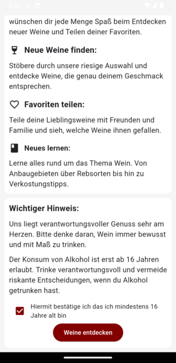
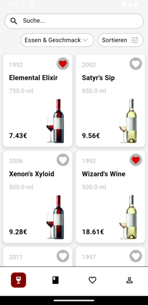
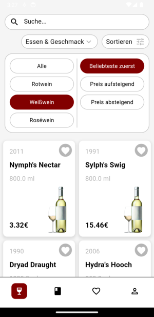
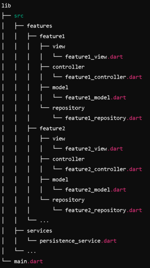

# VinoVeritas
## Abstract

VinoVeritas is an app that enables a stress-free and successful selection of wines. It offers various filtering options, its own favorites list, the ability to share favorites, and a mini-encyclopedia to help you get to grips with the technical jargon and expand your knowledge.

## Description
Choosing the right wine can be challenging, especially with the vast selection available in most supermarkets. Whether you're hosting a birthday party, planning a romantic evening, gathering with colleagues, or enjoying a family dinner, the perfect wine can enhance the experience. But with so many options, how do you decide which one to pick?

That's where this app comes in. Designed for people who don't have the time to become wine experts, the app helps you find the ideal wine for any occasion. It focuses on wines from the low to medium price range and tells you where you can find them in your local supermarket. With various filters and sorting options, you can easily choose a wine based on food pairing, taste, color, and price.

You can save your favorite wines in a personal favorites list, making it easy to find them again. You can also share your favorites with friends and see their top picks, making wine selection a fun and social activity.

The app includes a small wine dictionary to help you understand common wine terms like "sweet," "dry," "Blanc de Noir," "tannins," "woody," "Pinot Gris," and "oak barrel." This feature provides quick explanations, helping you build your wine knowledge without much effort, leading to better wine choices.

In summary, this app is a handy tool for anyone looking to quickly and easily find great wines at good prices, with the added benefit of learning more about wine along the way.

## Personas

Our app is designed for, among others 
- Housewives & mums who have a stressful everyday life looking after the household, the children and themselves at the same time. There's not much time to think about which wine was or could be good, especially when you're at the supermarket with the whining children. You might also want to find a suitable wine for dinner that won't hit your wallet too hard.
- Students who would like to drink wine from time to time as long as it doesn't put a strain on their already tight budget. The app is intended to help them not only to look at the price but also to find a reasonably priced wine that also tastes good and thus to enjoy wine more.
- Lawyers just starting out at work or other professional groups where drinking wine is part of the social interaction between colleagues. Here, of course, you don't want to embarrass yourself by turning up with a bad wine. But not everyone at the start of their career can afford to buy wine from a specialist shop with appropriate advice. 

## Screens & functions

The following section briefly explains which screens the app contains and which functions are available there.
### Sign in

| Login Page             |  Disclaimer & age verification |
:-------------------------:|:-------------------------:
  |  

When you open the app for the first time, the login screen is displayed. The user name is entered here and then you can get started.

### Homepage

 

The centrepiece of this App is our Homepage. A colourful mixture of different wines with clear information is immediately displayed here. 

| Sort             |  Filter food/taste |
:-------------------------:|:-------------------------:
  |  

The various filter functions can be used to find the right wine. Under Food & Flavour, you can select which food the wine should go with or which flavour note should be included. The wines displayed can also be sorted by colour or price.  
If you are interested in a wine, you can obtain further information by clicking on it (see also detailed view of wine). 
  
There is a search bar above the filters if you are looking for a specific wine. 
With a tab on the heart next to each wine, you can easily add the selected wine to your favourites list and remove it again with another tab on the heart.  
The app's navigation bar is located at the bottom of the screen. The current page is indicated by a red background colour. The first page with the wine glass icon is the homepage, one further to the right takes you to the encyclopaedia (book icon). A tab on the heart takes you to your favourites list and finally there is the settings page with the person icon. 

### Detailed view of wine

| Details Page             |  Details Expanded |
:-------------------------:|:-------------------------:
  |  

In the detailed view of a wine, it is presented in more detail. Information on price, size, dryness, sweetness and tannin content is displayed.  
Below the image is a fold-out information palette. The flavour components of the wine, matching dishes and a textual description are displayed here.  
Below the descriptions of the wine are supermarkets where this wine is available. The address and the price in this shop are displayed. Click on the arrow to exit the app and go to Google Maps with the supermarket labelled. This saves the user a time-consuming search for the relevant supermarket. 

### Lexikon
 

Directly below is the wine fact of the day. Every day there is a new exciting fact about wine. This enables knowledge transfer without the user having to click through the encyclopaedia.   
Under the fact of the day, there are various categories from viticulture to the finished wine in the glass. This makes it possible to search for specific information within the various stages in order to learn about the different aspects of a wine. The dropdowns allow you to quickly find topics that interest you, and the information is displayed when you expand them.

### Favourites list

The favourites page is very similar to the homepage. However, there is also the option (via drop-down selection) to choose which favourites list should be displayed, as the lists can also be shared and viewed with friends.

Only the wines marked with the heart are displayed here. A tab on the wine also takes you to the detailed view of the wine.

### Settings

A new user name can be assigned under "User name".  
In the "Design" section, users can choose between light and dark mode.
Under "Share with your favourites", users can find their personal code, which they can send to their friends so that they can access their own list. Below this, there is the option to enter codes that have been sent (under wine code), and under "Name of the list", the imported list can be given a name in order to maintain an overview. The list is then imported by clicking on "Import".

## Architecture 

The architecture of the app is based on a feature-first approach with an MVC+S structure (model-view-controller + service) using Cubit as the controller and go_router for routing as well as a persistence service with Isar. Each feature has its own view, a controller and a model. The view is divided into screens and widgets. In addition, a repository layer was partially introduced to extract the logic for communication between the controller and the persistence service.

### Architecture:

<b>View</b>: Consists of the screens and widgets that represent the user interface.

<b>Controller (Cubit)</b>: Manages the state and business logic of the app.

<b>Model</b>: Contains the data classes and the logic for managing the data.

<b>Repository</b>: Responsible for the abstraction of the data access logic, mediates between controller and persistence service.

<b>Service</b>: Responsible for retrieving and storing data, e.g. via the Isar persistence service.

## Installation

loading dependencies: `flutter pub get`  
loading app icon: `flutter pub run flutter_launcher_icons`  
build apk: `flutter build apk --no-tree-shake-icons`  
